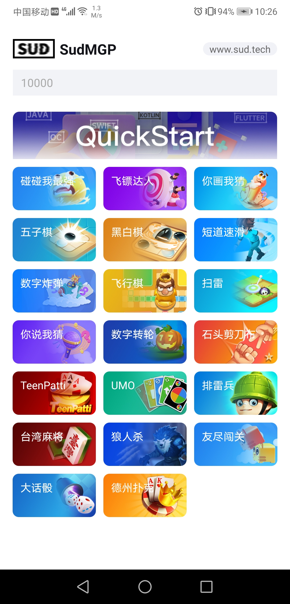
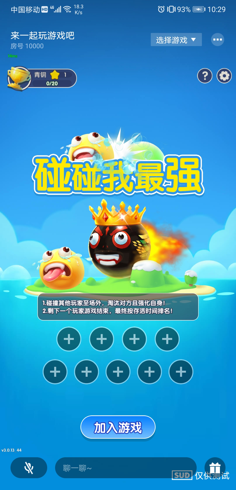
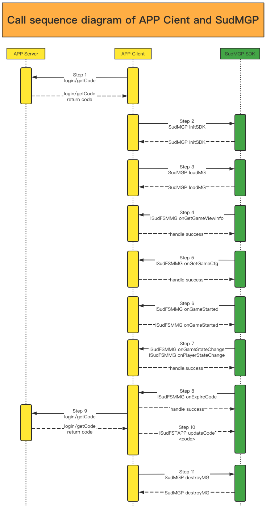

# 三分钟集成代码
- 第一步：导入'SudMGPSDK'、'SudMGPWrapper'两个Module，并在app主Module引入
- 第二步：拷贝BaseGameViewModel类，自定义GameViewModel继承它并实现对应方法
- 第三步：在页面中调用BaseGameViewModel.switchGame()方法加载游戏
- 第四步：页面销毁时调用BaseGameViewModel.onDestroy()方法释放资源

# QuickStart 架构图


# 1. SudMGP SDK
### 1.1 SudMGP Android 客户端SDK
- 例如：SudMGP-v1.1.52.554.aar
- [下载 SudMGP-Android SDK](https://github.com/SudTechnology/sud-mgp-android/releases)
  
### 1.2 SudMGP iOS 客户端SDK
- 例如：SudMGP.xcframework
- [下载 SudMGP-iOS SDK](https://github.com/SudTechnology/sud-mgp-ios/releases)

### 1.3 接入文档
- [接入文档](https://docs.sud.tech/zh-CN/app/Client/)

### 1.4 接入FAQ
 - 准备中，敬请期待

# 2. SudMGPWrapper
- `SudMGPWrapper封装SudMGP，简化App和游戏相互调用接口`；
- `SudMGPWrapper长期维护和保持更新`；
- `推荐APP接入方使用SudMGPWrapper`；
- `SudMGPAPPState`、`SudMGPMGState`、`SudFSMMGListener`、`SudFSMMGDecorator`、`SudFSTAPPDecorator核心类`；

### 2.1 App调用游戏
- `SudMGPAPPState` 封装 [App通用状态](https://docs.sud.tech/zh-CN/app/Client/APPFST/CommonState.html) ；
- `SudFSTAPPDecorator` 封装 [ISudFSTAPP](https://docs.sud.tech/zh-CN/app/Client/API/ISudFSTAPP.html) 两类接口，[notifyStateChange](https://docs.sud.tech/zh-CN/app/Client/APPFST/CommonState.html) 、 foo；
- `SudFSTAPPDecorator` 负责把每一个App通用状态封装成接口；
    <details>
    <summary>代码框架 java class SudFSTAPPDecorator</summary>

    ``` java
    public class SudFSTAPPDecorator {
        // iSudFSTAPP = SudMGP.loadMG(activity, userId, roomId, code, gameId, language, sudFSMMGDecorator);
        public void setISudFSTAPP(ISudFSTAPP iSudFSTAPP);
        // 1. 加入状态
        public void notifyAPPCommonSelfIn(boolean isIn, int seatIndex, boolean isSeatRandom, int teamId);
        ...
    
        // 16. 设置游戏中的AI玩家（2022-05-11新增）
        public void notifyAPPCommonGameAddAIPlayers(List<SudMGPAPPState.AIPlayers> aiPlayers, int isReady);
        public void startMG();
        public void pauseMG();
        public void playMG();
        public void stopMG();
        public void destroyMG();
        public void updateCode(String code, ISudListenerNotifyStateChange listener);
        public void pushAudio(ByteBuffer buffer, int bufferLength);
        ...
    }
    ```
    </details>

### 2.2 游戏调用App
- `SudMGPMGState` 封装 [通用状态-游戏](https://docs.sud.tech/zh-CN/app/Client/MGFSM/CommonStateGame.html) 和 [通用状态-玩家](https://docs.sud.tech/zh-CN/app/Client/MGFSM/CommonStatePlayer.html) ；
- `SudFSMMGListener` 封装[ISudFSMMG](https://docs.sud.tech/zh-CN/app/Client/API/ISudFSMMG.html) 三类回调函数，onGameStateChange、onPlayerStateChange、onFoo；
- `SudFSMMGListener` 负责把游戏每一个状态封装成单独的回调函数；
    <details>
    <summary>代码框架 java interface SudFSMMGListener</summary>
    
    ``` java
    public interface SudFSMMGListener {
    default void onGameLog(String str) {}
    void onGameStarted();
    void onGameDestroyed();
    void onExpireCode(ISudFSMStateHandle handle, String dataJson);
    void onGetGameViewInfo(ISudFSMStateHandle handle, String dataJson);
    void onGetGameCfg(ISudFSMStateHandle handle, String dataJson);
    
        // 通用状态 - 游戏
        // void onGameStateChange(ISudFSMStateHandle handle, String state, String dataJson)；
        // 文档: https://docs.sud.tech/zh-CN/app/Client/MGFSM/CommonStateGame.html
        // 1.游戏公屏消息
        default void onGameMGCommonPublicMessage(ISudFSMStateHandle handle, SudMGPMGState.MGCommonPublicMessage model);
        ...
    
        // 21. 游戏通知app层添加陪玩机器人是否成功（2022-05-17新增）
        default void onGameMGCommonGameAddAIPlayers(ISudFSMStateHandle handle, SudMGPMGState.MGCommonGameAddAIPlayers model);
        
        // 通用状态 - 玩家
        // void onPlayerStateChange(ISudFSMStateHandle handle, String userId, String state, String dataJson);
        // 文档: https://docs.sud.tech/zh-CN/app/Client/MGFSM/CommonStatePlayer.html
        // 1.加入状态
        default void onPlayerMGCommonPlayerIn(ISudFSMStateHandle handle, String userId, SudMGPMGState.MGCommonPlayerIn model);
        ...
    
        // 11. 游戏通知app层当前游戏剩余时间（2022-05-23新增，目前UMO生效）
        default void onPlayerMGCommonGameCountdownTime(ISudFSMStateHandle handle, String userId, SudMGPMGState.MGCommonGameCountdownTime model);
    
        // 游戏个性化状态：你画我猜
        // 文档：https://docs.sud.tech/zh-CN/app/Client/MGFSM/DrawGuess.html
        // 1. 选词中状态
        default void onPlayerMGDGSelecting(ISudFSMStateHandle handle, String userId, SudMGPMGState.MGDGSelecting model);
        ...
    }
    ```
    </details>
- [ISudFSMMG](https://docs.sud.tech/zh-CN/app/Client/API/ISudFSMMG.html) 的装饰类`SudFSMMGDecorator`，负责派发每一个游戏状态，缓存需要的游戏状态；
    <details>
    <summary>代码框架 java class SudFSMMGDecorator</summary>
    
    ``` java
    public class SudFSMMGDecorator implements ISudFSMMG {
        // 设置回调
        public void setSudFSMMGListener(SudFSMMGListener listener);
        // 游戏日志
        public void onGameLog(String dataJson);
        // 游戏加载进度
        public void onGameLoadingProgress(int stage, int retCode, int progress);
        // 游戏已开始，游戏长连接完成
        public void onGameStarted();
        // 游戏销毁
        public void onGameDestroyed();
        // Code过期，必须实现；APP接入方必须调用handle.success，释放异步回调对象
        public void onExpireCode(ISudFSMStateHandle handle, String dataJson);
        // 获取游戏View信息，必须实现；APP接入方必须调用handle.success，释放异步回调对象
        // GameViewInfoModel文档: https://docs.sud.tech/zh-CN/app/Client/API/ISudFSMMG/onGetGameViewInfo.html
        public void onGetGameViewInfo(ISudFSMStateHandle handle, String dataJson);
        // 获取游戏Config，必须实现；APP接入方必须调用handle.success，释放异步回调对象
        // GameConfigModel文档: https://docs.sud.tech/zh-CN/app/Client/API/ISudFSMMG/onGetGameCfg.html
        public void onGetGameCfg(ISudFSMStateHandle handle, String dataJson);
        // 游戏状态变化；APP接入方必须调用handle.success，释放异步回调对象
        public void onGameStateChange(ISudFSMStateHandle handle, String state, String dataJson);
        // 游戏玩家状态变化，APP接入方必须调用handle.success，释放异步回调对象
        public void onPlayerStateChange(ISudFSMStateHandle handle, String userId, String state, String dataJson);
  
        ...
    }
    ```
    </details>

# 3. QuickStart
- 请使用QuickStart项目运行；
- QuickStart使用SudMGPWrapper、SudMGPSDK实现快速接入游戏；
- 快速接入文档：[StartUp-Android](https://docs.sud.tech/zh-CN/app/Client/StartUp-Android.html) 和 [StartUp-iOS](https://docs.sud.tech/zh-CN/app/Client/StartUp-iOS.html) ；
- `QuickStartGameViewModel` 负责login(App getCode) --> SudMGP.initSDK --> SudMGP.loadMG；
- `GameActivity` 负责addGameView；
- `QuickStart 服务端` [hello-sud-java](https://github.com/SudTechnology/hello-sud-java) ，login(App getCode 获取短期令牌code) ，`如果访问不了代码仓库，请联系SUD添加，github账号`；

# 4. QuickStart运行效果图



# 5. 接入方客户端和SudMGP SDK调用时序图


