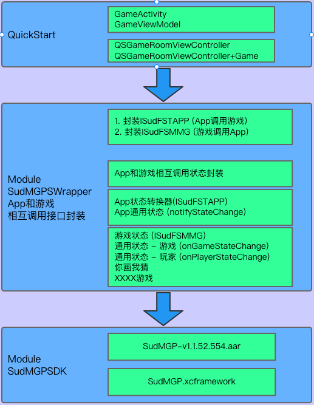
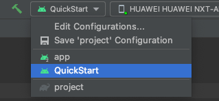

# 1. QuickStart

- 1.1. 依赖SudMGPSDK、SudMGPWrapper快速接入游戏。
- 1.2. 参考文档：[StartUp-Android](https://docs.sud.tech/zh-CN/app/Client/StartUp-Android.html)
- 1.3. Run此项目：
- 1.4. 核心类：
  - 1.4.1. `tech.sud.mgp.hello.ui.game.GameViewModel`
    - 职责： login --> initSdk --> loadMG
  - 1.4.2. `tech.sud.mgp.hello.GameActivity`
    - 职责： addGameView

# 2. SudMGPWrapper
  - 1. App和游戏相互调用接口封装
    - 1.1. 封装ISudFSTAPP（App调用游戏）：`SudFSTAPPDecorator` <br>
      在调用`SudMGP.loadMG`时会返回`ISudFSTAPP`对象，该对象被`SudFSTAPPDecorator`封装。 <br>
      参考文档：[ISudFSTAPP](https://docs.sud.tech/zh-CN/app/Client/API/ISudFSTAPP.html) <br><br>
    - 1.2. 封装ISudFSMMG（游戏调用App）：`SudFSMMGDecorator` <br>
      在调用`SudMGP.loadMG`时需要传入`ISudFSMMG`对象，`SudFSMMGDecorator`实现了`ISudFSMMG`接口。 <br>
      参考文档：[ISudFSMMG](https://docs.sud.tech/zh-CN/app/Client/API/ISudFSMMG.html) <br>
      其中`SudFSMMGListener`是`SudFSMMGDecorator`的回调接口，回调装饰之后的游戏状态等等。<br>
      `SudFSMMGListener`类中有标明哪些是需要实现的方法。可参考`GameViewModel`的用法。<br>
  

  - 2. App和游戏相互调用状态封装
    - 2.1. App调用游戏或者游戏调用App都是使用Json数据格式进行通信，`SudMGPWrapper`将这些数据(状态)定义成Model。<br><br>
    - 2.2. **App状态**：`SudMGPAPPState` <br>
      `SudFSTAPPDecorator`已将其封装为方法参数，开发者通常情况下只需要关注方法参数即可。<br>
      参考文档：[App状态](https://docs.sud.tech/zh-CN/app/Client/APPFST/) <br><br>
    - 2.3. **游戏状态**：`SudMGPMGState`<br>
      参考文档：[游戏状态](https://docs.sud.tech/zh-CN/app/Client/MGFSM/) <br>
      游戏通过`ISudFSMMG`接口将状态通知到App。<br><br>
      - 2.3.1. **通用状态-游戏**
        - 参考文档：[通用状态-游戏](https://docs.sud.tech/zh-CN/app/Client/MGFSM/CommonStateGame.html)
          - 通过onGameStateChange方法通知
            ```
            /**
             * 游戏状态变化
             * APP接入方需要调用handle.success
             * @param handle
             * @param state
             * @param dataJson
             */
            void onGameStateChange(ISudFSMStateHandle handle, String state, String dataJson);
            ```
      - 2.3.2. **通用状态-玩家**
          - 参考文档：[通用状态-玩家](https://docs.sud.tech/zh-CN/app/Client/MGFSM/CommonStatePlayer.html)
            - 通过onPlayerStateChange方法通知
              ```
              /**
               * 游戏玩家状态变化
               * APP接入方需要调用handle.success
               * @param handle
               * @param userId
               * @param state
               * @param dataJson
               */
              void onPlayerStateChange(ISudFSMStateHandle handle, String userId, String state, String dataJson);
              ```
      - 2.3.3. **游戏特定状态**
        - 同样是通过onPlayerStateChange方法通知
        - 2.3.3.1. **你画我猜**
            - 参考文档：[你画我猜](https://docs.sud.tech/zh-CN/app/Client/MGFSM/DrawGuess.html) <br><br>

    - 2.4. **游戏配置Model：**`GameConfigModel`
      ```
      /**
       * 获取游戏Config
       * @param handle
       * @param dataJson {}
       * 最低版本：v1.1.30.xx
       */
      void onGetGameCfg(ISudFSMStateHandle handle, String dataJson);
      ```
      参考文档：[onGetGameCfg](https://docs.sud.tech/zh-CN/app/Client/API/ISudFSMMG/onGetGameCfg.html) <br>
      参考代码：`tech.sud.mgp.hello.ui.game.GameViewModel` <br><br>
  
    - 2.5. **游戏视图Model：**`GameViewInfoModel`
      ```
      /**
       * 获取游戏View信息
       * @param handle
       * @param dataJson {}
       */
      void onGetGameViewInfo(ISudFSMStateHandle handle, String dataJson);
      ```
  
      参考文档：[onGetGameViewInfo](https://docs.sud.tech/zh-CN/app/Client/API/ISudFSMMG/onGetGameViewInfo.html) <br>
      参考代码：`tech.sud.mgp.hello.ui.game.GameViewModel`

# 3. SudMGPSDK
- SudMGPSDK提供游戏接入的能力

# 5. 项目目录介绍
目录|介绍
---|---
QuickStart      |	快速接入示例
app             |	可下载APK体验：[HelloSudDemo](https://www.sud.tech/?lang=zh)
SudMGPSDK       |	存放SudMGP aar包
SudMGPWrapper   |	对SudMGP的封装

# 6. 接入文档
[接入文档](https://docs.sud.tech/zh-CN/app/Client/)
