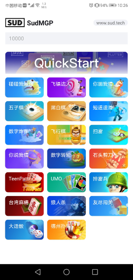
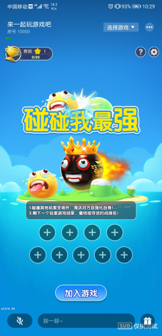

# QuickStart Guide for Fast Access and Integration with SUD Games 
 
- Step 1: Integrate SUD Games into the APP client (3-minute integration code) 
  <details> 
  <summary>Detailed description</summary> 

      1. Use the appId, appKey, and isTestEnv=true from the QuickStart client. 
      2. Use the iOS bundleId and Android applicationId from your own APP client (as specified in the integration information table). 
      3. Use the short-term token code from the QuickStart backend service (obtained from login/getCode). 
      4. Complete the integration and run the game. 
      *** SUD platform supports binding multiple bundleIds and applicationIds to a single appId. *** 
      *** After filling out the integration information table, SUD will bind the bundleId and applicationId of the APP to the appId of QuickStart, only in the test environment. *** 
  QuickStart backend service [hello-sud-java code repository](https://github.com/SudTechnology/hello-sud-java),  contact SUD to add if unable to access the code repository, provide your GitHub account . 
  </details> 
- Step 2: Integration and debugging between the APP client and APP server 
  <details> 
  <summary>Detailed description</summary> 

      1. Implement 4 HTTP APIs in the APP server (as specified in the integration information table). 
      2. Implement the login/getCode interface in the APP server to obtain the short-term token code. 
      3. Use your own appId, appKey, isTestEnv=true, bundleId(iOS), and applicationId(Android) in the APP client. 
      4. Use the login/getCode interface of your own APP server to obtain the short-term token code. 
      5. Debug 5 HTTP APIs between the APP client and APP server. 
      6. Complete the debugging of the HTTP APIs. 
  </details> 
- Step 3: Focus on your own business requirements in the APP 
  <details> 
  <summary>Detailed description</summary> 

      1. Refer to SudMGP documentation, SudMGPWrapper, QuickStart, and HelloSud demo (demonstrates multiple scenarios, including custom scenarios). 
      2. Focus on APP UI interaction, functionality support, and implementation. 
         For example: 
         - Adjusting the size and position of the game view. 
         - Adjusting the interaction flow between the APP and the game, including hiding UI elements, hiding APP implementation behind buttons, and supporting interception callbacks for click events. 
      3. Focus on the APP's business logic and implementation. 
         For example: 
         - How to pass numerical and key parameters during a game session (settlement). 
   
   
  </details> 
# 3-Minute Integration Code 
- Step 1: Import the SudMGPWrapper module 
  <details> 
  <summary>Detailed description</summary> 

      1. Use Android Studio's Import Module feature to import SudMGPWrapper. 
      2. Add the SudMGPWrapper dependency in the build.gradle file of the main project.

  ``` java
  build.gradle

  dependencies {
     // Import SudMGPWrapper
     implementation project(':SudMGPWrapper')
  }

  ```

  </details>


- Step 2: Copy the 3 QuickStart files and keep the configuration parameters unchanged 
  <details> 
  <summary>Detailed description</summary> 

      1. Copy the following 3 files: 
         BaseGameViewModel.java 
         QuickStartGameViewModel.java 
         QuickStartUtils.java 
      2. Use the appId and appKey from the QuickStart client (keep the configuration parameters unchanged). 
         In the QuickStartGameViewModel.java file:
         
  ```java
  /** appId obtained from the Sud platform */
  public static String SudMGP_APP_ID = "1461564080052506636";
  /** appKey obtained from the Sud platform */
  public static String SudMGP_APP_KEY = "03pNxK2lEXsKiiwrBQ9GbH541Fk2Sfnc";
  /** true for the test environment when loading the game, false for the production environment */
  public static final boolean GAME_IS_TEST_ENV = true;

  ```
      3. Use the login/getCode interface of the QuickStart backend service in the APP client. 
         *** Use the QuickStart service to quickly load and run the game. *** 
         *** The SUD platform supports binding multiple bundleIds and applicationIds to a single appId. *** 
         *** After filling out the integration information table, SUD will bind the bundleId and applicationId of the APP to the appId of QuickStart, only in the test environment. *** 
  </details>


- Step 3: Define a game view container in the layout file, for example: activity_game.xml 
    <details> 
    <summary>Detailed description activity_game.xml</summary>

    ``` xml
    <!-- Game view container, the android:visibility property should not be set to gone -->
    <FrameLayout
        android:id="@+id/game_container"
        android:layout_width="match_parent"
        android:layout_height="match_parent" />
    ```
    </details>


- Step 4: Create an instance of QuickStartGameViewModel and map it to the corresponding lifecycle, for example: QuickStartActivity 
    <details> 
    <summary>Detailed description QuickStartActivity.java</summary> 

      1. Implement adding and removing the game view. 
      2. Implement the lifecycle (optional). 
      3. Code:
    ``` java
    private final QuickStartGameViewModel gameViewModel = new QuickStartGameViewModel(); // Create the ViewModel
    @Override
    protected void onCreate(@Nullable Bundle savedInstanceState) {
        super.onCreate(savedInstanceState);
        FrameLayout gameContainer = findViewById(R.id.game_container); // Get the game view container
        gameViewModel.gameViewLiveData.observe(this, new Observer<View>() {
            @Override
            public void onChanged(View view) {
                if (view == null) { // Remove the game view when closing the game
                    gameContainer.removeAllViews();
                } else { // Add the game view to the container
                    gameContainer.addView(view, FrameLayout.LayoutParams.MATCH_PARENT, FrameLayout.LayoutParams.MATCH_PARENT);
                }
            }
        });
    }
    @Override
    protected void onResume() {
        super.onResume();
        updateStatusBar();
        // Note: Call the onResume() method here
        gameViewModel.onResume();
    }
    @Override
    protected void onPause() {
        super.onPause();
        // Note: Call the onPause() method here
        gameViewModel.onPause();
    }
    ```
    </details>


- Step 5: Load the game 
    <details> 
    <summary>Detailed description QuickStartActivity.java</summary>

    ``` java
    // Load the game, parameters can be viewed in the comments of the BaseGameViewModel.switchGame() method
    // APP room ID
    String appRoomId = "10000";       
    // SudMGP platform 64-bit game ID
    long mgId = 1461227817776713818L; // This is the mgId for 'Ping Pong Me the Strongest', replace it with a different mgId for a different game
    gameViewModel.switchGame(this, appRoomId, mgId);    
    ```
    </details>


- Step 6: Destroy the game 
    <details> 
    <summary>Detailed description QuickStartActivity.java</summary>

    ``` java
    // Destroy the game before the page is destroyed
    gameViewModel.onDestroy();
    finish(); 
    ```
    </details>

# QuickStart Architecture Diagram


# 1. SudMGP SDK
### 1.1 SudMGP Client SDK
- [Android SDK](https://github.com/SudTechnology/sud-mgp-android/blob/main/README_en.md)
- [iOS SDK](https://github.com/SudTechnology/sud-mgp-ios/blob/main/README_en.md)

### 1.2 Integration Documentation
- [Integration Documentation](https://docs.sud.tech/en-US/app/Client/API/)
- [FAQ](https://docs.sud.tech/en-US/app/Client/FAQ/)

# 2. SudMGPWrapper
- SudMGPWrapper encapsulates SudMGP and simplifies the interaction between the app and the game.
- SudMGPWrapper is continuously maintained and kept up to date.
- It is recommended for app developers to use SudMGPWrapper.
- Core classes of SudMGPWrapper include SudMGPAPPState, SudMGPMGState, SudFSMMGListener, SudFSMMGDecorator, and SudFSTAPPDecorator.

If you have any further questions or need more information, feel free to ask!

### 2.1 App Calling the Game 

-  `SudMGPAPPState`  encapsulates [App Common State](https://docs.sud.tech/en-US/app/Client/APPFST/CommonState.html). 
-  `SudFSTAPPDecorator`  encapsulates [ISudFSTAPP](https://docs.sud.tech/en-US/app/Client/API/ISudFSTAPP.html) interfaces, including [notifyStateChange](https://docs.sud.tech/app/Client/APPFST/CommonState.html) and foo. 
-  `SudFSTAPPDecorator`  is responsible for encapsulating each App common state into an interface.  
Here is a code framework for the  SudFSTAPPDecorator  class:
    <details> 
    <summary>Code framework for Java class SudFSTAPPDecorator</summary>

    ``` java
    public class SudFSTAPPDecorator {
        // iSudFSTAPP = SudMGP.loadMG(QuickStartActivity, userId, roomId, code, gameId, language, sudFSMMGDecorator);
        public void setISudFSTAPP(ISudFSTAPP iSudFSTAPP);
        // 1. Join state
        public void notifyAPPCommonSelfIn(boolean isIn, int seatIndex, boolean isSeatRandom, int teamId);
        ...
        // 16. Set AI players in the game (added on 2022-05-11)
        public void notifyAPPCommonGameAddAIPlayers(List<SudMGPAPPState.AIPlayers> aiPlayers, int isReady);
        public void startMG();
        public void pauseMG();
        public void playMG();
        public void stopMG();
        public void destroyMG();
        public void updateCode(String code, ISudListenerNotifyStateChange listener);
        public void pushAudio(ByteBuffer buffer, int bufferLength);
        ...
    }
    ```
    </details>

### 2.2 Game Calling the App 
-  `SudMGPMGState`  encapsulates [Common State - Game](https://docs.sud.tech/en-US/app/Client/MGFSM/CommonStateGame.html) and [Common State - Player](https://docs.sud.tech/en-US/app/Client/MGFSM/CommonStatePlayer.html). 
-  `SudFSMMGListener`  encapsulates three types of callback functions from [ISudFSMMG](https://docs.sud.tech/en-US/app/Client/API/ISudFSMMG.html): onGameStateChange, onPlayerStateChange, and onFoo. 
-  `SudFSMMGListener`  is responsible for encapsulating each game state into separate callback functions. 
    <details>
    <summary>Code framework for Java interface SudFSMMGListener</summary>

    ```java
    public interface SudFSMMGListener {
    default void onGameLog(String str) {}
    void onGameStarted();
    void onGameDestroyed();
    void onExpireCode(ISudFSMStateHandle handle, String dataJson);
    void onGetGameViewInfo(ISudFSMStateHandle handle, String dataJson);
    void onGetGameCfg(ISudFSMStateHandle handle, String dataJson);
    // Common State - Game
    // void onGameStateChange(ISudFSMStateHandle handle, String state, String dataJson);
    // Documentation: [Common State - Game](https://docs.sud.tech/app/Client/MGFSM/CommonStateGame.html)
    // 1. Game common public message
    default void onGameMGCommonPublicMessage(ISudFSMStateHandle handle, SudMGPMGState.MGCommonPublicMessage model);
    ...
    // 21. Game notifies the app layer whether adding AI players is successful (added on 2022-05-17)
    default void onGameMGCommonGameAddAIPlayers(ISudFSMStateHandle handle, SudMGPMGState.MGCommonGameAddAIPlayers model);
    // Common State - Player
    // void onPlayerStateChange(ISudFSMStateHandle handle, String userId, String state, String dataJson);
    // Documentation: [Common State - Player](https://docs.sud.tech/app/Client/MGFSM/CommonStatePlayer.html)
    // 1. Player join state
    default void onPlayerMGCommonPlayerIn(ISudFSMStateHandle handle, String userId, SudMGPMGState.MGCommonPlayerIn model);
    ...
    // 11. Game notifies the app layer of the remaining game time (added on 2022-05-23, currently effective for UMO)
    default void onPlayerMGCommonGameCountdownTime(ISudFSMStateHandle handle, String userId, SudMGPMGState.MGCommonGameCountdownTime model);
    // Game-specific state: Draw Guess
    // Documentation: [Draw Guess](https://docs.sud.tech/app/Client/MGFSM/DrawGuess.html)
    // 1. Selecting word state
    default void onPlayerMGDGSelecting(ISudFSMStateHandle handle, String userId, SudMGPMGState.MGDGSelecting model);
    ...
    }
    ```
    </details>
- The decorator class  `SudFSMMGDecorator`  for [ISudFSMMG](https://docs.sud.tech/en-US/app/Client/API/ISudFSMMG.html) is responsib
    <details>
    <summary>Code framework for Java interface SudFSMMGDecorator</summary>

    ``` java
    public class SudFSMMGDecorator implements ISudFSMMG {
    // Set the callback
    public void setSudFSMMGListener(SudFSMMGListener listener);
    // Game log
    public void onGameLog(String dataJson);
    // Game loading progress
    public void onGameLoadingProgress(int stage, int retCode, int progress);
    // Game has started, game long connection is complete
    public void onGameStarted();
    // Game destroyed
    public void onGameDestroyed();
    // Code expired, must be implemented; APP integrators must call handle.success to release the asynchronous callback object
    public void onExpireCode(ISudFSMStateHandle handle, String dataJson);
    // Get game view information, must be implemented; APP integrators must call handle.success to release the asynchronous callback object
    // GameViewInfoModel documentation: [link](https://docs.sud.tech/app/Client/API/ISudFSMMG/onGetGameViewInfo.html)
    public void onGetGameViewInfo(ISudFSMStateHandle handle, String dataJson);
    // Get game config, must be implemented; APP integrators must call handle.success to release the asynchronous callback object
    // GameConfigModel documentation: [link](https://docs.sud.tech/app/Client/API/ISudFSMMG/onGetGameCfg.html)
    public void onGetGameCfg(ISudFSMStateHandle handle, String dataJson);
    // Game state change; APP integrators must call handle.success to release the asynchronous callback object
    public void onGameStateChange(ISudFSMStateHandle handle, String state, String dataJson);
    // Player state change, APP integrators must call handle.success to release the asynchronous callback object
    public void onPlayerStateChange(ISudFSMStateHandle handle, String userId, String state, String dataJson);
    // ...
    }
    ```
    </details>

# 3. QuickStart 
- Please use the QuickStart project to run. 
- QuickStart uses SudMGPWrapper for quick integration of games. 
- Quick integration documentation: [StartUp-Android](https://docs.sud.tech/en-US/app/Client/StartUp-Android.html) and [StartUp-iOS](https://docs.sud.tech/en-US/app/Client/StartUp-iOS.html). 
-  `QuickStartGameViewModel`  is responsible for login (App getCode), SudMGP.initSDK, and SudMGP.loadMG. 
-  `GameActivity`  is responsible for adding the game view. 
-  `QuickStart Server`  [hello-sud-java](https://github.com/SudTechnology/hello-sud-java) for login (App getCode to obtain short-term token code). `If you cannot access the code repository, please contact SUD to add your GitHub account.` 

# 4. QuickStart Demo Screenshots 

 
 

- HelloSud Demo (showcasing multiple business scenarios) 

 
 
 
# 5. Sequence Diagram for Client and SudMGP SDK Invocation 
 

# 6. Other Considerations 
- For initial integration, please choose the appropriate SDK based on the game you want to integrate. You can find the SDK here: [SudMGPSDK](https://github.com/SudTechnology/sud-mgp-android/blob/main/README_en.md). 
- If you need to use the ASR multilingual recognition capability, simply add  implementation 'tech.sud.mgp:SudASR:1.3.1.1127'  to your project's build.gradle. This will enable multilingual recognition for languages such as English, German, Arabic, and more. 
- If your project has resource obfuscation enabled, please add the following items to the proguard whitelist:
    <details>
    <summary>Resource obfuscation whitelist list</summary>

    ``` groovy
    "R.drawable.fsm_*",  
    "R.string.fsm_*",  
    "R.layout.fsm_*"',  
    "R.color.fsm_*",  
    "R.id.fsm_*,  
    "R.style.fsm_*",  
    "R.dimen.fsm_*",           
    "R.array.fsm_*",  
    "R.integer.fsm_*"',
    "R.bool.fsm_*",
    "R.mipmap.fsm_*",
    "R.styleable.fsm_*",
    "R.id.*loading*",
    "R.id.container_progress",
    "R.id.reload_btn",
    "R.id.unitySurfaceView",
    "R.string.game_view_content_description"  
    ```
    </details>