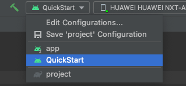

# 1. QuickStart
- 1.1. 依赖SudMGPSDK、SudMGPWrapper快速接入游戏。
- 1.2. 参考文档：[StartUp-Android](https://docs.sud.tech/zh-CN/app/Client/StartUp-Android.html)
- 1.3. Run此项目：
- 1.4. 核心类：
  - 1.4.1. `tech.sud.mgp.hello.ui.game.GameViewModel`
    - 职责： login --> initSdk --> loadMG
  - 1.4.2. `tech.sud.mgp.hello.GameActivity`
    - 职责： addGameView

# 2. SudMGPWrapper
- 2.1. 位于SudMGPSDK与应用之间，对SudMGPSDK进一步封装，便于开发者快速接入。
- 2.2. App和游戏相互调用接口封装
  - 2.2.1. 封装ISudFSTAPP（App调用游戏）：`tech.sud.mgp.hello.SudMGPWrapper.decorator.SudFSTAPPDecorator` <br>
    在调用`SudMGP.loadMG`时会返回`ISudFSTAPP`对象，该对象被`SudFSTAPPDecorator`封装。 <br>
    参考文档：[ISudFSTAPP](https://docs.sud.tech/zh-CN/app/Client/API/ISudFSTAPP.html) <br>
  - 2.2.2. 封装ISudFSMMG（游戏调用App）：`tech.sud.mgp.hello.SudMGPWrapper.decorator.SudFSMMGDecorator` <br>
    在调用`SudMGP.loadMG`时需要传入`ISudFSMMG`对象，`SudFSMMGDecorator`实现了`ISudFSMMG`接口。 <br>
    参考文档：[ISudFSMMG](https://docs.sud.tech/zh-CN/app/Client/API/ISudFSMMG.html) <br>
    其中`SudFSMMGListener`是`SudFSMMGDecorator`的回调接口，回调装饰之后的游戏状态等等。<br>
    `SudFSMMGListener`类中有标明哪些是需要实现的方法。可参考`tech.sud.mgp.hello.ui.game.GameViewModel`的用法。<br>
- 2.3. App和游戏相互调用状态封装
  - 2.3.1. App调用游戏或者游戏调用App都是使用Json数据格式进行通信，`SudMGPWrapper`将这些数据(状态)定义成Model，便于开发者快速接入。<br>
  - 2.3.2. **App状态**：`tech.sud.mgp.hello.SudMGPWrapper.state.SudMGPAPPState` <br>
    `SudFSTAPPDecorator`已将其封装为方法参数，开发者通常情况下只需要关注方法参数即可。<br>
    参考文档：[App状态](https://docs.sud.tech/zh-CN/app/Client/APPFST/) <br>
  - 2.3.3. **游戏状态**：`tech.sud.mgp.hello.SudMGPWrapper.state.SudMGPMGState`<br>
    参考文档：[游戏状态](https://docs.sud.tech/zh-CN/app/Client/MGFSM/) <br>
    游戏通过`ISudFSMMG`接口将状态通知到App。<br>
    - 2.3.3.1. **游戏通用状态**
      - 参考文档：[通用状态-游戏](https://docs.sud.tech/zh-CN/app/Client/MGFSM/CommonStateGame.html)
      - 通过onGameStateChange方法通知
        ```
        /**
         * 游戏状态变化
         * APP接入方需要调用handle.success或handle.fail
         * @param handle
         * @param state
         * @param dataJson
         */
        void onGameStateChange(ISudFSMStateHandle handle, String state, String dataJson);
        ```
    - 2.3.3.2. **玩家通用状态**
        - 参考文档：[通用状态-玩家](https://docs.sud.tech/zh-CN/app/Client/MGFSM/CommonStatePlayer.html)
        - 通过onPlayerStateChange方法通知
          ```
          /**
           * 游戏玩家状态变化
           * APP接入方需要调用handle.success或handle.fail
           * @param handle
           * @param userId
           * @param state
           * @param dataJson
           */
          void onPlayerStateChange(ISudFSMStateHandle handle, String userId, String state, String dataJson);
          ```
    - 2.3.3.3. **游戏特定状态**
      - 同样是通过onPlayerStateChange方法通知
      - 2.3.3.3.1. **你画我猜**
          - 参考文档：[你画我猜](https://docs.sud.tech/zh-CN/app/Client/MGFSM/DrawGuess.html)
        
  - 2.3.4. **游戏配置Model：**`tech.sud.mgp.hello.SudMGPWrapper.model.GameConfigModel`
    ```
    /**
     * 获取游戏Config
     * @param handle
     * @param dataJson {}
     * 最低版本：v1.1.30.xx
     */
    void onGetGameCfg(ISudFSMStateHandle handle, String dataJson);
    ```
    参考文档：[onGetGameCfg](https://docs.sud.tech/zh-CN/app/Client/API/ISudFSMMG/onGetGameCfg.html) <br>
    参考代码：`tech.sud.mgp.hello.ui.game.GameViewModel`

  - 2.3.5. **游戏视图Model：**`tech.sud.mgp.hello.SudMGPWrapper.model.GameViewInfoModel`
    ```
    /**
     * 获取游戏View信息
     * @param handle
     * @param dataJson {}
     */
    void onGetGameViewInfo(ISudFSMStateHandle handle, String dataJson);
    ```

    参考文档：[onGetGameViewInfo](https://docs.sud.tech/zh-CN/app/Client/API/ISudFSMMG/onGetGameViewInfo.html) <br>
    参考代码：`tech.sud.mgp.hello.ui.game.GameViewModel`

# 3. SudMGPSDK
- SDK提供游戏接入的能力

# 4. 依赖关系
- SudMGPSDK --> SudMGPWrapper --> QuickStart

# 6. 项目目录介绍
目录|介绍
---|---
QuickStart      |	快速接入示例
app             |	可下载APK体验：[HelloSudDemo](https://docs.sud.tech/zh-CN/app/Client/Demo/)
SudMGPSDK       |	存放sdk aar包
SudMGPWrapper   |	对SDK的封装

# 7. 接入文档
[Client](https://docs.sud.tech/zh-CN/app/Client/)
