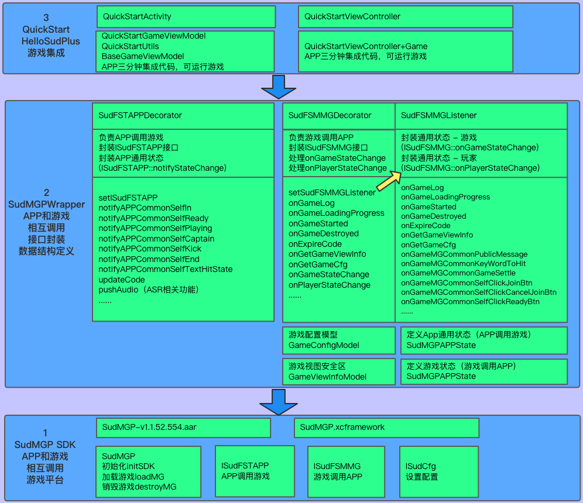

# 1. HelloSudPlus 架构图


## 2. 源码下载 
- [hello-sud-plus-android](https://github.com/SudTechnology/hello-sud-plus-android/releases)
- [hello-sud-plus-ios](https://github.com/SudTechnology/hello-sud-plus-ios/releases)

## 3. 项目描述
1. APP接入方客户端具体示例
- [hello-sud-plus-android](https://github.com/SudTechnology/hello-sud-plus-android)
- [hello-sud-plus-ios](https://github.com/SudTechnology/hello-sud-plus-ios)
2. APP接入方服务端示例
- [hello-sud-plus-java](https://github.com/SudTechnology/hello-sud-plus-java)

## 4. 快速运行示例方法
- 方法1：使用Sud官方部署的hello-sud-plus-java服务，且使用HelloSud的appId、appKey、applicationId(Android)、bundleID(iOS)
```
    Android 
       1. Android Studio打开hello-sud-android-v1.1.1/project
       2. run
    
    iOS
       1. 进入hello-sud-ios-v1.1.1/project
       2. pod install
       3. xcode打开HelloSud-iOS.xcworkspace
       4. run
```

- 方法2：使用APP接入方部署的hello-sud-plus-java服务，且使用HelloSud的appId、appKey、applicationId(Android)、bundleID(iOS)
```
    Android
       1. Android Studio打开hello-sud-android-v1.1.1/project
       2. 将https://base-hello-sud.sud.tech/和https://interact-hello-sud.sud.tech/替换成APP接入方部署的hello-sud-plus-java服务地址
       3. run

    iOS
       1. 进入hello-sud-ios-v1.1.1/project
       2. pod install
       3. xcode打开HelloSud-iOS.xcworkspace
       4. 将https://base-hello-sud.sud.tech/和https://interact-hello-sud.sud.tech/替换成APP接入方部署的hello-sud-plus-java服务地址
       5. run
```     
- 方法3：使用APP接入方部署的hello-sud-plus-java服务，且使用APP接入方自己的appId、appKey、applicationId(Android)、bundleID(iOS)
``` 
    Android 
       1. Android Studio打开hello-sud-android-v1.1.1/project
       2. 将https://base-hello-sud.sud.tech/和https://interact-hello-sud.sud.tech/替换成APP接入方部署的hello-sud-plus-java服务地址
       3. 在hello-sud-plus-java服务端，修改appId、appKey(APP接入方在Sud平台申请的)
       4. 将Android applicationId和iOS bundleID替换成APP接入方的
       5. run

    iOS
       1. 进入hello-sud-ios-v1.1.1/project
       2. pod install
       3. xcode打开HelloSud-iOS.xcworkspace
       4. 将https://base-hello-sud.sud.tech/和https://interact-hello-sud.sud.tech/替换成APP接入方部署的hello-sud-plus-java服务地址
       5. 在hello-sud-plus-java服务端，修改appId、appKey(APP接入方在Sud平台申请的)
       6. 将Android applicationId和iOS bundleID替换成APP接入方的
       7. run
```

### 5. 支持演示场景：
- 语聊房场景
- ASR场景(语音识别)
- 门票场景
- 竞猜场景
- 跨房玩游戏场景
- 点单场景
- 1V1场景
- 才艺房场景
- 秀场场景
- 联赛场景
- 自定义场景